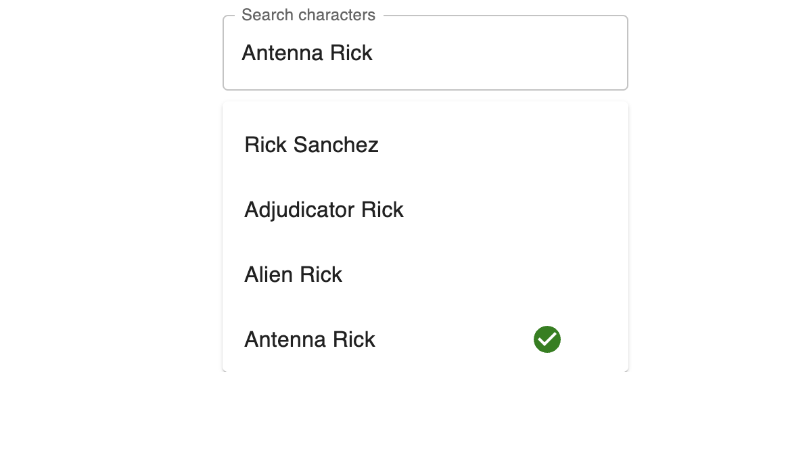

# Rick and Morty Autocomplete Project

This project is a React-based application using Next.js and GraphQL to create an autocomplete search component for Rick and Morty characters.

## Screenshot



## Setup Instructions

### Prerequisites

Ensure you have Node.js version 18.17.0 installed. You can use [nvm](https://github.com/nvm-sh/nvm) to manage Node versions.

### Step 1: Install Dependencies

First, install all the necessary dependencies by running:

```bash
npm install
```

### Step 2: Build the Project

To build the project, run:

```bash
npm run build
```

### Step 3: Run the Development Server

To start the development server, run:

```bash
npm run dev
```

This will start the development server on `http://localhost:3000`.

### Step 4: Run Tests

To run the tests, use:

```bash
npm run test
```

### Step 5: Run Linter

To run the linter and check for code style issues, use:

```bash
npm run lint
```

## Description

The application fetches and displays a list of characters from the Rick and Morty API based on user input. It highlights the selected item and displays a green checkmark next to it.

### Features

- Autocomplete search for Rick and Morty characters
- Highlight selected item with a green checkmark
- Responsive and clean user interface
- Accessible components with ARIA labels

## Technologies Used

- React
- Next.js
- GraphQL
- Apollo Client
- Material-UI
- Jest
- React Testing Library
- TypeScript